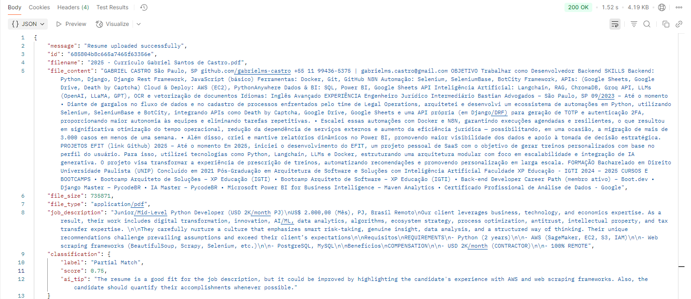

# Resume Classifier API

## 📌 About the Project

The **Resume Classifier API** is a backend service designed to classify resumes (CVs) using machine learning models. It provides an API endpoint for uploading resumes as raw text or files (PDF), processes them to extract relevant content, and returns predicted job categories along with confidence scores.

This project is built using:

- ⚙️ **FastAPI** for the API layer
- 🧠 **Langchain with Gemini LLM** for resume analyze
- 📦 **MongoDB** for storing extracted resumes, classification results, and submission metadata
- ✅ **Pydantic** for input validation
- 🧪 **Pytest** for API and service-level testing
- 🐳 **Docker** for containerized development and deployment

> The goal is to create a modular, scalable, and production-ready API that demonstrates backend and ML engineering skills while solving a realistic use case.
---
## Demo
Users can submit their **resume** via `POST`request to the `/upload_resume/` endpoint.
The system performs the following steps:
1. Validates file MIME type and it content
2. Extracts file content using the `text_extractor_service.py`
3. Analyzes the resume against the job description using **Gemini via Langchain** 
4. Return a structured output:
  - The **classification** (Match, Partial Match, No Match)
  - A **score** between 0 and 1
  - An **AI generated tip** with a practical advice of how to improve the resume for the job

### Example Output

---

## 🗓️ Dev Log

### [2025-06-15] - Project Kickoff
- Researched:
  - How to build RESTful APIs using **FastAPI**
  - **Pydantic** models for request validation and OpenAPI documentation
  - Connecting **MongoDB** with FastAPI using the async driver `motor`
- Started project scaffolding:
  - Created initial folder structure:
    - `app/models` for Pydantic schemas
    - `app/db` for MongoDB connection logic
    - `app/services` for ML and file parsing logic
    - `app/api` for route definitions
- Planned initial API route `/upload_resume/`:
  - Accepts uploaded file (`UploadFile`)
  - Extracts text and classifies using a discriminative model
  - Stores classification result in MongoDB

### [2025-06-16] - upload_resume logic and Text Extraction Structure
- Defined the core `/upload_resume` route logic in `routes.py`:
- Began implementing the Text Extraction module in `/services/text_extractor.py`
    -  Implemented specialized subclasses:
        - `PdfTextExtractor()`
        - `MSWordTextExtractor()`
        - `PlainTextExtractor()`
    - I've also created a centralized extractor selection via `call_text_extractor()`
  
### [2025-06-19] - upload_resume logic and Text Extraction Structure
- Finished `text_extractor`module and created some tests for it at `./tests/text_extractor.py`
- I'm considering just using a LLM API for the classifier (although IDK if it would be the best decision)

### [2025-06-21] - Persistency Layer, Docker Compose and API 
- More Project structure organizing and renamed some folders
  - Added a `Makefile` for managing development commands.
  - Created a `run.sh` script to start both the API and MongoDB via Docker Compose.
- MongoDB integration:
  - Created a MongoDB conncetion handler `DBConnectionHandler`
  - Built a `ResumesRepository` with a working `insert_document` method for persistence.
- Created a `docker-compose.yml`for MongoDB startup
- Integrated `lifespan` context manager for startup and shutdown events:
  - On startup: establish DB connection
  - On shutdown: closes DB connection 
  >(I think it's a good one, i don't have anybody to ask for lol)

### [2025-06-22] - Persistency Layer, Docker Compose and API
- Implemented Resume Analyzer with LLM:
  - Introduced the use of **Langchain** with **Gemini** to process resume and job description inputs using Natural Language
  - Created a `llm_classifier.py`and `config.py`under `app/services/AI/`to encapsulate prompt configuration and model interaction logic.
- Integrated AI analysis directly into the `/upload_resume/ route.
- Schema Updates:
  - Added `job_description` and `ai_tip`to the `ResumeUploadRequest`model.
  - Updated `ClassificationDict` with AI-generated suggestions for candidates.
- Cleanup and Refactor:
  - Removed obsolete `classifier.py`.
  - Updated `requirements.txt` to reflect Langchain and Gemini dependencies.

